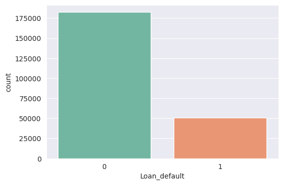
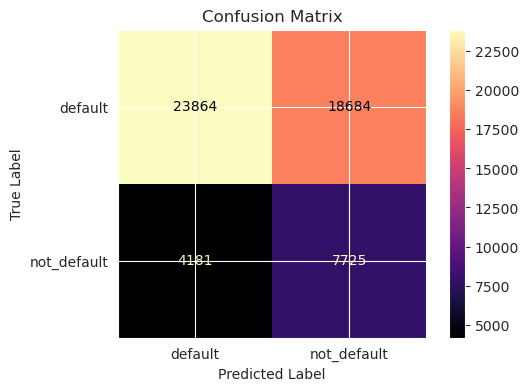
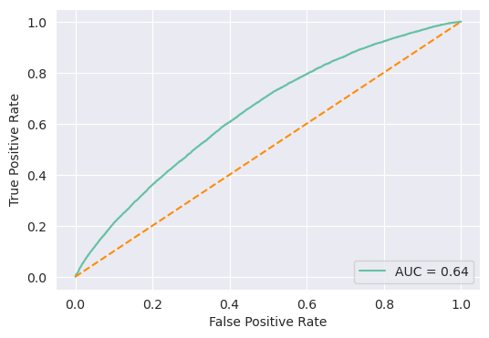

# Loan Default Classification Model

## Overview
Financial institutions often face significant losses due to loan defaults. By building a loan default classification model, these institutions can make more informed decisions, mitigate risks, and improve their lending strategies. In this project, I have developed a model to predict loan defaults for motor vehicle loans.

## Business Understanding
The goal of this project is to predict loan defaults for motor vehicle loans issued by LNT Financial Services in India. Loan defaults occur when borrowers fail to repay their loans, resulting in financial losses for the lender. By analyzing factors contributing to loan defaults, we can assess the creditworthiness of loan applicants and implement strategies to minimize financial risks.

## Data Insights
Our dataset includes information on 233,154 loans issued over a period of 336 days, spanning from January to December 2018. It consists of 40 variables that provide valuable insights into loan default patterns. Understanding these patterns helps lenders make informed decisions and improve risk assessment strategies.

## Models and Techniques
We employed various classification models to predict loan defaults, including:
- Logistic Regression
- Decision Trees
- K-Nearest Neighbors
- Random Forest
- Gradient Boosting, AdaBoost, and XGBoost. 

> Through iterative testing and hyperparameter tuning, we found that the LOgistics algorithm performed exceptionally well in improving our model's recall, although the accuracy was wanting.

## Key Metrics
We primarily focused on the Recall metric in our evaluation. A high Recall rate is crucial in this context, as misclassifying a default loan as non-default can result in substantial financial losses. We also considered AUC and F1 scores, while accuracy and precision were secondary metrics due to their lesser significance in this domain.

## Model Performance
Our trained model achieved the following results:
- Accuracy: 58.01%
- Precision: 29.25%
- Recall: 64.89%
- F1 Score: 40.33%
- AUC: 64.47%

## Conclusion
In this project, I successfully developed a loan default classification model that assists financial institutions in identifying potential loan defaults among motor vehicle loans. By leveraging advanced machine learning techniques, we improved risk assessment accuracy and empowered lenders to make more informed decisions, ultimately reducing financial losses associated with loan defaults.
 
> Author: [Mithamo Beth](https://github.com/Mythamor/Mythamor) 